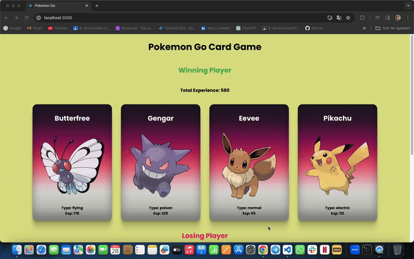

# Pokemon

<h1>Pokemon Go Card Game</h1>

Bu heyecan verici oyunu JavaScript, React.js ve CSS kullanarak hazırladım. Kartlar arasında her bir pokemon için özel güçler belirledim. Her sayfa yenilendiğinde, rastgele güçlerin toplamıyla kazanan ve kaybeden oyuncuyu ekranda görebilirsiniz.

<h1>Detay</h1>

🔹 React.js ile dinamik kullanıcı arayüzü oluşturma
🔹 CSS ile görsel çekicilik ve düzen
🔹 JavaScript ile oyun mantığını ve rastgele sayı üretimini yönetme

